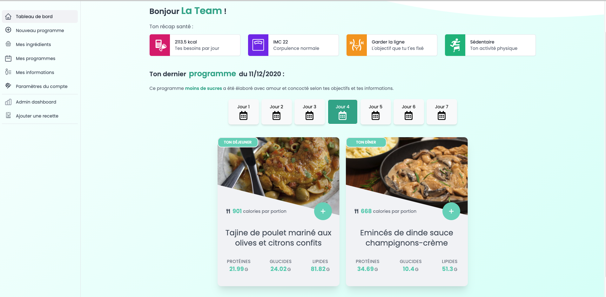

#  Mealories 

Merci pour ta visite sur ce repo ! 
Nous te présentons Mealories, notre projet final au sein de la session 14 de The Hacking Project.

## 🍪 Le parcours utilisateur 🍪

### Compte administrateur

Pour visiter direction Heroku : http://mealories.herokuapp.com/

Le compte => Email : **mealories@hotmail.com** || Mot de passe: **123456**

La partie admin sera accessible dans la sidebar du tableau de bord.

### Compte utilisateur

1. S'inscrire
2. Remplir sa fiche d'informations
3. Créez vos menus !

## 🍗 Pourquoi Mealories ? 🍗

Parce que notre temps et notre santé sont précieux mais parfois difficilement concilliables, nous vous proposons Mealories.
Le but ? Mieux manger, en laissant nous laissant choisir vos repas, calculés directement depuis vos données. 
Les recettes sont importées de https://www.marmiton.org/ et leurs informations nutritionnelles analysées.

## Les auteurs 🐦

* Axel Vigroux : https://github.com/AxelVigroux
* Uriel Sautron : https://github.com/Uriel-Sautron
* Martin Moradi : https://github.com/martinmoradi
* David Lobry: https://github.com/DLBY
* Team Perruches, THP 2020.

##### Un grand merci à notre mentor Luca Montaitgut : https://github.com/luca-montaigut
