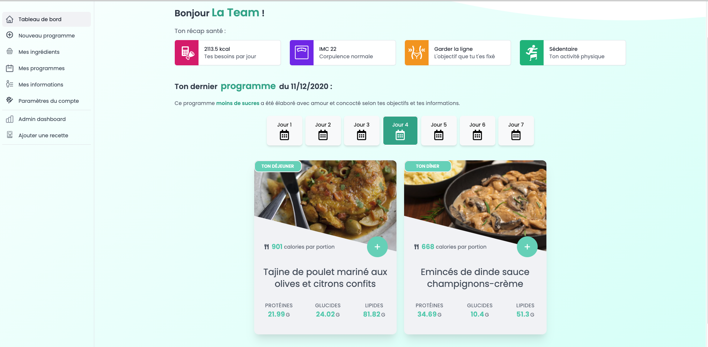

# `📆 ` Mealories :apple:

## Présentation

L'application permet de générer des menus de 1 à 7 jours, en fonction de chaque utilisateur. Elle permet ensuite de recevoir sa liste de course par mail.

## 🍪 Le parcours utilisateur 🍪

### Compte administrateur

Pour visiter direction heroku : http://mealories.herokuapp.com/

Le compte => Email : **mealories@hotmail.com** || Mot de passe: **123456**

La partie admin sera accessible dans la sidebar du tableau de bord.

### Compte utilisateur

1. S'inscrire
2. Remplir sa fiche d'informations
3. Créez vos menus !

## 🍗 Pourquoi Mealories ? 🍗

Mealories est un projet réalisé pour répondre à un besoin qu'on peut rencontrer en cuisine: le manque d'inspiration.

L'application permet d'allier gain de temps et bien-être car elle permet de mieux contrôller ses repas.

## Les auteurs 🐦

* Axel Vigroux : https://github.com/AxelVigroux
* Uriel Sautron : https://github.com/Uriel-Sautron
* Martin Moradi : https://github.com/martinmoradi
* David Lobry: https://github.com/DLBY

##### Merci à notre mentor Luca Montaitgut : https://github.com/luca-montaigut
